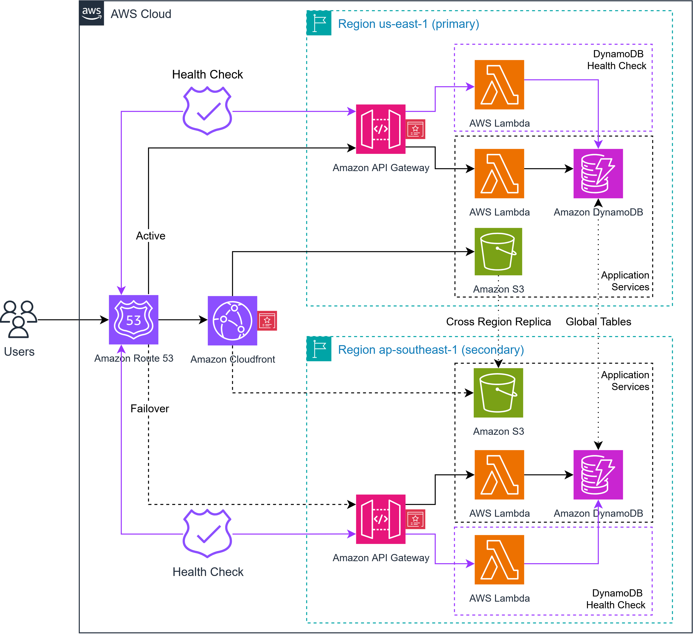

# Multi Region Serverless Disaster Recovery

## The problem

A regional outage makes every workload hosted in that region unavailable at the same time. Planning for that event means committing to two outcomes in advance: how quickly service must return, and how much data loss is acceptable. Those commitments determine the architecture, the running cost, and how much of the recovery can be automated.

## The solution

This repository deploys one serverless stack to two AWS regions from the same SAM template. Region A (us-east-1) serves traffic and region B (ap-southeast-1) runs warm, ready to take over if region A fails. The static site is served through CloudFront with a standby origin, the API address is published through Route 53 health check failover, and application data lives in one DynamoDB global table replicated to both regions.

The implementation targets recovery within five minutes and minimal data loss. The failover was tested and drilled with the measured results recorded below.

## Architecture



## Failover path

- Site: CloudFront serves the static site from the primary bucket in region A, and switches to the standby bucket in region B when the primary stops responding.
- API: two health checks call the `/health` endpoint, and the failover DNS records move the API address to region B when region A fails.
- Data: one DynamoDB global table keeps both regions readable and writable, so the standby region holds current data without a restore step.
- Fault injection: a drill policy on the health function role fails region A on purpose. Removing it restores region A.

## Tech stack

| Service | Purpose in this project |
|---|---|
| AWS SAM and CloudFormation | One template deployed to both regions, with conditions gating the region specific resources |
| Amazon S3 | Static site hosting in both regions, versioning and cross region replication |
| Amazon CloudFront | Content delivery, origin group failover, origin access control for the buckets |
| Amazon Route 53 | Public hosted zone, health checks, and failover records for the API address |
| Amazon API Gateway | REST API for the health and item endpoints |
| AWS Lambda, Python 3.13 | Health check, item create, and item read handlers |
| Amazon DynamoDB | Global table for application data, with point in time recovery |
| AWS Certificate Manager | TLS certificates for the site and API domains |
| Amazon CloudWatch and Amazon SNS | API 5XX alarm with email notification |
| AWS IAM | Function roles, plus the drill policy used to simulate the outage |

## Measured results

| Objective | Target | Measured |
|---|---|---|
| RTO, time until service is available again | under 5 minutes | 3 minutes 33 seconds |
| RPO, data loss window | under 1 minute | about 3 seconds |

Five drills were executed. Failback to region A completed cleanly in each successful run, with no redeploy required.

## Running guide

Prerequisites: AWS CLI v2 with credentials configured, AWS SAM CLI, Python 3.13, and a bash shell such as Git Bash on Windows.

```bash
git clone https://github.com/Brysteven/multi-region-serverless-disaster-recovery.git
cd dr-serverless
aws sts get-caller-identity
sam validate
sam build
sam deploy --region us-east-1
sam deploy --region ap-southeast-1
```

Deploy region A first, because the table and the primary bucket are created there. Each deploy prints the changeset and asks for confirmation. Set `TableName`, `BucketPrefix`, `DomainName`, and `AlarmEmail` in `parameter_overrides` before the first deploy, then confirm the SNS subscription email. Bucket names are built from `BucketPrefix` plus the region and your account id, so they stay globally unique, and the primary bucket name is reported in the `FrontendBucketName` stack output.

Publish the site, then check the health endpoint:

```bash
BUCKET=$(aws cloudformation describe-stacks --stack-name dr-serverless --region us-east-1 \
  --query "Stacks[0].Outputs[?OutputKey=='FrontendBucketName'].OutputValue" --output text)
aws s3 cp site/index.html "s3://$BUCKET/"
curl -s https://<api-id>.execute-api.us-east-1.amazonaws.com/Prod/health
```

```json
{"status": "ok", "region": "us-east-1"}
```

Custom domains, certificates, and the failover DNS records are optional. They are created only when `DomainName` and `HostedZoneId` are provided, otherwise the stack runs on default AWS hostnames.

### Testing failover

`scripts/drill.sh` runs the drill end to end. It fails the health check in region A, waits for Route 53 to move the record, checks that an item written before the outage is still readable from the standby region, then restores region A. Usage and expected output are in [docs/drill.md](docs/drill.md).

## Repository map

| Path | Contents |
|---|---|
| `template.yaml` | One SAM template deployed to both regions, with conditions gating region specific resources |
| `src/` | Lambda handlers for the health check, item create, and item read |
| `site/` | Static site served through CloudFront |
| `scripts/` | `drill.sh` runs the failover drill, `watch-dns.sh` records the API region and DNS answer (set `API_HOST` to your own endpoint) |

## Evidence

Drill results and supporting artifacts: [docs/evidence.md](docs/evidence.md)
